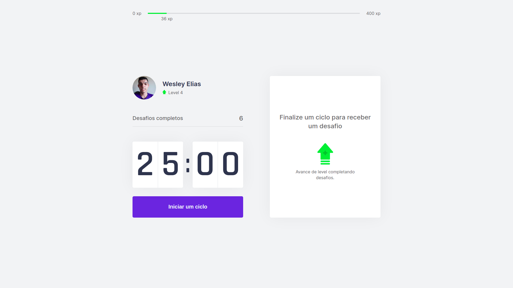
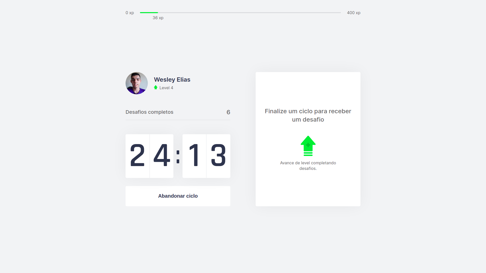
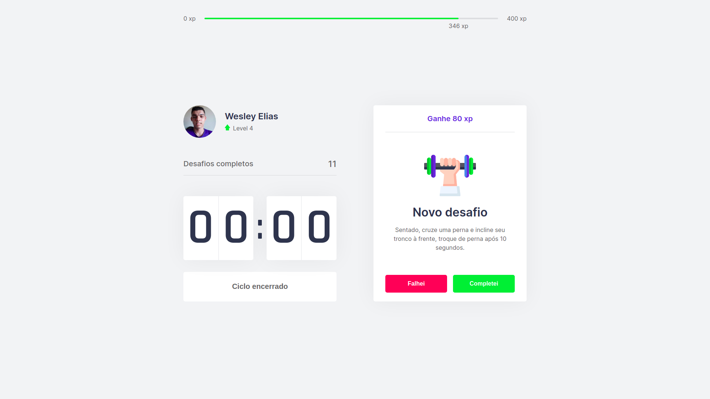
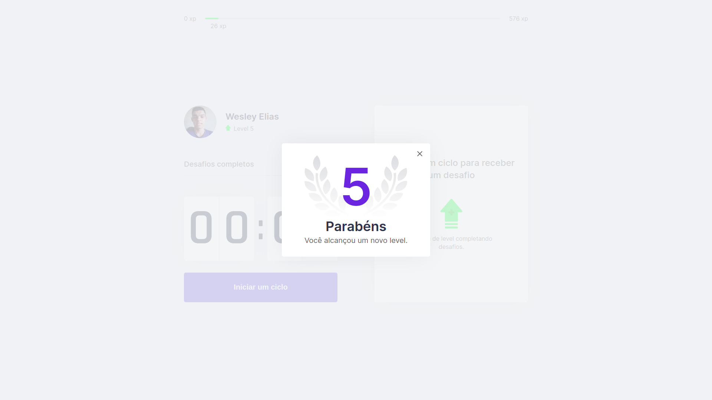

<!-- ==> ==> ==> ==> Logo/Imagem <== <== <== <== -->

<div align="center" >
  
  
</div>

<!-- ==> ==> ==> ==> Badges <== <== <== <== -->

<p align="center">

       

  

  

  

</p>

<p align="center">
  <a href="#page_facing_up-sobre-o-projeto">Sobre o Projeto</a>&nbsp;&nbsp;&nbsp;|&nbsp;&nbsp;&nbsp;
  <a href="#hammer_and_wrench-tecnologias">Tecnologias</a>
  &nbsp;&nbsp;&nbsp;|&nbsp;&nbsp;&nbsp;
  <a href="#🖼️-imagens-do-projeto">Imagens do Projeto</a>&nbsp;&nbsp;&nbsp;|&nbsp;&nbsp;&nbsp;
  <a href="#clipboard-requisitos-para-rodar-a-aplicação">Requisitos</a>&nbsp;&nbsp;&nbsp;|&nbsp;&nbsp;&nbsp;
  <a href="#rocket-rodando-a-aplicação">Rodando a Aplicação</a>&nbsp;&nbsp;&nbsp;|&nbsp;&nbsp;
  <a href="#thought_balloon-inspiração">Inspiração</a>
</p>

<!-- ==> ==> ==> ==> Demostração da Aplicação <== <== <== <== -->

<h1 align="center">
  
</h1>

<!-- ==> ==> ==> ==> Título <== <== <== <== -->

#   Moveit | Next Level Week


<!-- ==> ==> ==> ==> Sobre o projeto <== <== <== <== -->

## :page_facing_up: Sobre o Projeto

<p align="justify"> 
  O Moveit é uma projeto realizado pela #rocketseat durante o evento NLW(Next Level Week). Trata-se de uma aplicação desenvolvida do zero em semana com o objetivo de alcançarmos o próximo nível de evolução como desenvolvedor.
</p>

<p align="justify">
  Nesta edição, a aplicação tem como objetivo obter melhores aproveitamentos nas nossas atividades utilizando a técnica de pomodoro, que consiste basicámente em focar em alguma atividade por cerca de 25 minutos e descansar por 5 minutos. Dessa forma conseguimos manter foco total nas nossas atividades sem que fiquemos muito desgastados.
</p>

<p align="justify">
  A proposta do Move.it é unir a técnica de pomodoro com exercícios físicos e alongamentos leves. O Move.it possui um crônometro de 25 minutos, que quando ativado, realizamos alguma atividade e logo após esse tempo é liberado exercícios aleatórios para relaxar. Esse processo pode ser repetido várias vezes, então na medida que vamos completando atividades, ganhamos experiência e subimos nosso nível.
</p>

<!-- ==> ==> ==> ==> Tecnologias/Ferramentas/Linguagens/Frameworks usados <== <== <== <== -->

## :hammer_and_wrench: Tecnologias

  <p>
    Este projeto foi desenvolvido com as seguintes tecnologias:
  </p>

### :books: Linguagens/Frameworks
  
- [TypeScript](https://www.typescriptlang.org/)
- [React](https://pt-br.reactjs.org/)
- [Next.js](https://nextjs.org/)
- CSS 

### :anchor: Hooks

* [useState](https://pt-br.reactjs.org/docs/hooks-state.html) - Hook que permite usar o state e outros recursos do React sem escrever uma classe.
* [useEffect](https://pt-br.reactjs.org/docs/hooks-effect.html) - Hook que permite executar efeitos colaterais em componentes funcionais.
* [useContext](https://pt-br.reactjs.org/docs/hooks-reference.html) - Hook que permite que dados sejam acessados por muitos componentes em diferentes níveis.

### :toolbox: Ferramentas

* [Figma](https://www.figma.com/) - Ferramenta de criação design de interfaces. 
* [Visual Studio Code](https://code.visualstudio.com/) - IDE de Desenvolvimento.
  
## 🖼️ Imagens do Projeto

<div align="center" >
  
</div>

</br>

<div align="center" >
  
</div>

</br>

<div align="center" >
  
</div>

</br>

<div align="center" >
  
</div>

<!-- ==> ==> ==> ==> Executando a aplicação <== <== <== <== -->

## :clipboard: Requisitos para rodar a aplicação

- Ter [**Git**](https://git-scm.com/) para clonar o projeto.
- Ter [**Node.js**](https://nodejs.org/en/) instalado.
- Ter [**Yarn**](https://yarnpkg.com/) para instalar as dependências do projeto.

## :rocket: Rodando a Aplicação

```bash
# Clone este repositório
$ git clone https://github.com/Wesley-Elias/Moveit_NLW-04.git

# Acesse a pasta do projeto
$ cd Moveit_NLW-04

# Instale as dependências com yarn
$ yarn

# Inicie o servidor
$ yarn dev
```
Agora você pode acessar [`localhost:3000`](http://localhost:3000) do seu navegador.

<!-- ==> ==> ==> ==> Inspirações/Referências <== <== <== <== -->

## :thought_balloon: Inspiração

* [Diego Fernandes](https://github.com/diego3g) - Next Level Week

Feito com :heart: por [Wesley Elias](https://github.com/Wesley-Elias) 👋🏼
